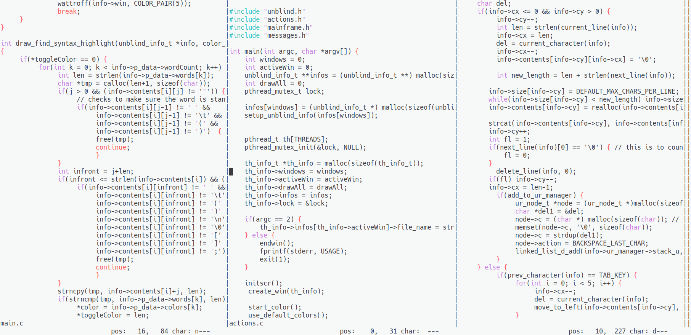

# Unblind 

The idea of unblind is to have a full text editor in the terminal with every keyboard shortcut of non-terminal editors. The editor is very portable as it is written in C and compiles to a single file.
Unblind uses common keybinds so you don't have to waste your time looking up every single action you need to use.

## Installation Steps
* Clone repository: `git clone https://www.github.com/markslayer456/unblind/ .`
* Cd to src folder: `cd unblind/src/`
* Run install: `./install`
* Executable is created in src folder

## Documentation and Help
* cheatsheet.txt has a list of all keybinds

